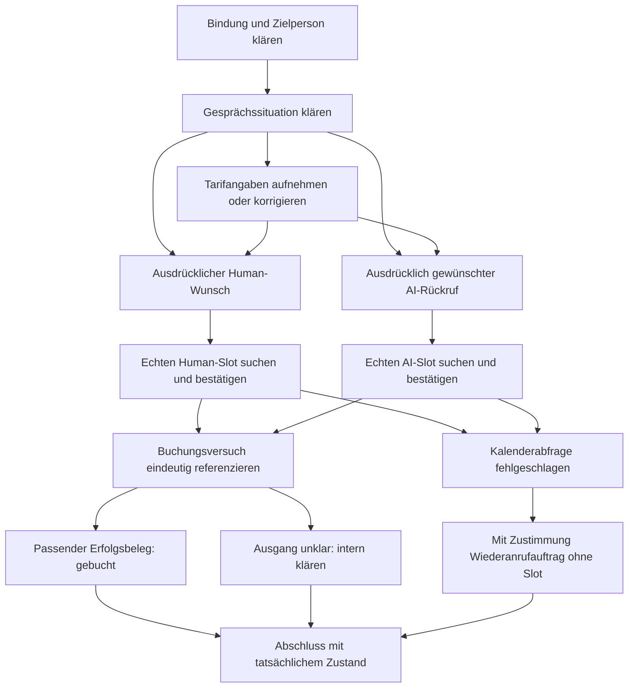

# Michaela: umsetzbare Spezifikation des bestätigten Sollablaufs

Stand: 09.09.2026, UTC. **SPEZIFIKATIONSENTWURF ZUR GESAMTABNAHME**.
Die Fachentscheidungen F01–F10 sind bestätigt. Die gemeinsame Gesamtabnahme,
ergänzende Konkretisierungen und neue gemeinsame technische Verträge sind nicht
freigegeben. Technische Bestandsprüfung: **PASS_WITH_GAPS**, keine Produktabnahme.

Direkter Dokumentationsauftrag in Codex-Aufgabe `01a08828-f991-71a1-b062-c679b4f75672`.
Original und Zielagent: `/Users/activi/Documents/ChatGPT/Livekit agent`.
Keine registrierte Workerrolle übernommen, kein Ticket beansprucht oder geändert.
Bearbeiter: Codex im Auftrag des Projektauftraggebers. Externe Zielversion: nicht
geprüft. Quellstände und tatsächliche Prüfungen: [technischer Nachweis](20260909-michaela-spec-nachweis.md).

Lesereihenfolge: Anforderungen und Zustandsmodell in diesem Dokument, vollständige
[Fallmatrix](20260909-michaela-spec-matrix.md), anschließend
[Schnittstellenvorschläge](20260909-michaela-spec-vertraege.md). Alle vier Dokumente
bilden einen gemeinsamen Entwurf. Kein Dokument ersetzt die bestehenden ADRs.

## Problem Statement — Problem

Michaela soll Kunden durch einen kurzen deutschen Tarifcheck zu einer passenden
menschlichen Beratung oder einem ausdrücklich gewünschten AI-Rückruf führen.
Heute vermischt der Agent teilweise Gesprächserlaubnis, Interesse und Rückruf.
Tarifwerte sind nicht durchgehend je Energieart modelliert. Mehrere Gesprächsenden
und unklare Buchungsversuche lassen sich nicht vollständig exportieren. Dadurch
können bestätigte Kundenwünsche verloren gehen oder unbelegte Zusagen entstehen.

Die bestehenden lokalen Tests belegen einzelne Schutzmechanismen, aber weder den
vollständigen Sollablauf noch dessen produktive Wirkung. Diese Spezifikation
übersetzt die entschiedenen Regeln in überprüfbare Anforderungen und grenzt
lokale Vorbereitung von benötigten gemeinsamen Verträgen ab.

## Solution — Zielverhalten

Michaela stellt sich als Michaela von StepEnergy vor, duzt grundsätzlich und
übernimmt einen Wunsch nach Siezen. Sie bestätigt ihre AI-Identität auf Nachfrage
wahrheitsgemäß. Sie klärt die Zielperson und die Bereitschaft für das jetzige
Gespräch, behandelt Einwände kurz und passend und beendet bei bestätigter
Ablehnung oder eindeutigem Stoppsignal.

Sie erfasst aktuelle Tarifwerte je gewünschter Energieart, verwertet mehrere
Angaben einer Antwort und behält die letzte bestätigte Korrektur. Ein Human-Angebot
ist bei ausdrücklichem Human-Wunsch **oder** vollständigen Kerndaten mindestens
einer gewünschten Sparte erlaubt. Die Kerndaten sind aktueller kWh-Preis,
Grundpreis und Jahresverbrauch. Anbieter und Zählernummer werden erfragt, sind
aber keine Terminpflicht. Reine Gasberatung ist zulässig.

Human- und AI-Termine brauchen echte passende Slots, sichere Personenbindung,
bestätigte Rückrufnummer, konkrete Zustimmung und positiven Buchungsbeleg. Ein
Kalenderproblem kann mit Zustimmung einen Wiederanrufauftrag ohne festen Slot
erzeugen. Ein unklarer Buchungsausgang bleibt dagegen intern zu klären, ohne
Ersatzbuchung, technischen Kundendialog oder zusätzlichen Klärungsrückruf.
Gesprächsende, Kundenwunsch, tatsächliche Buchung und Speicherzustand bleiben
getrennt erhalten.

## Verbindlichkeit und Quellen

| Kennung | Bedeutung in diesem Paket |
|---|---|
| B / D | Bestätigte Fachentscheidung bzw. bestehendes ADR; Referenzen entsprechen dem Workshopregister. D03–D07 stammen teilweise aus V3 und beweisen keine Übernahme ins Original. |
| R | Anforderung dieses Entwurfs. Die zugrunde liegende Fachentscheidung kann bestätigt sein; technische Ausgestaltung und Abnahmekriterium bleiben Teil der offenen Gesamtabnahme. |
| I / F | Frisch gelesener Iststand bzw. nachgewiesener Fehler. Der Nachweis benennt, ob statisch oder ausgeführt. |
| V | Lokaler Umsetzungsvorschlag, keine angenommene Architekturänderung. |
| SV | Gemeinsamer Vertragsvorschlag ausschließlich zur Supervisorprüfung. Kein gültiger Wirewert und keine bereits vorhandene Backendfähigkeit. |
| AC | Geplantes Abnahmekriterium. Die Definition eines AC ist kein bestandener Test. |

Maßgebliche lokale Quellen sind [README](../../../../README.md),
[CONTEXT](../../../../CONTEXT.md), [Domain-Routing](../../../agents/domain.md),
[ADR 0001](../../../decisions/0001-call-scoped-architecture.md),
[ADR 0002](../../../decisions/0002-einwaende-und-gespraechsende.md),
[ADR 0003](../../../decisions/0003-terminart-nach-datenvollstaendigkeit.md),
[ADR 0004](../../../decisions/0004-anrede-und-gespraechsvorstellung.md),
[ADR 0005](../../../decisions/0005-kalenderfehler-und-unklare-buchungen.md),
[Workshop](20260909-michaela-sollablauf-workshop.md) und
[Leadstatusentwurf](20260909-michaela-leadstatus-zur-abnahme.md).

Die ältere pauschale Human-Schranke aus B10 ist durch B11 präzisiert. B21
„Kalenderfehler ohne Rückrufzusage abschließen“ ist durch B25 ausdrücklich ersetzt.
Die ältere V3-Annahme „Strom immer“ begrenzt die neu bestätigte Gas-only-Regel
B15 nicht. Historische Aufforderungen im Workshop, weitere Fachfragen zu
beantworten, sind durch dessen konsolidierten Stand F01–F10 überholt. Keine dieser
Korrekturen bedeutet eine Gesamtabnahme oder einen gemeinsamen API-Vertrag.

Das gemeinsame
[EnergyWarm-ADR-005](</Users/activi/Documents/ChatGPT/EnergyWarm Supervisor/docs/decisions/ADR-005-livekit-v3-workflow.md>)
regelt den V3-/Übernahmeweg; es ist ein anderes Dokument als das lokale ADR 0005.
Aktuelle [Registry](</Users/activi/Documents/ChatGPT/EnergyWarm Supervisor/PROJECTS.json>),
[Worker-Routine](</Users/activi/Documents/ChatGPT/EnergyWarm Supervisor/docs/agents/linear-worker.md>)
und ADR-006 regeln tatsächliche Ticketrollen. Die direkte Dokumentationssitzung
erteilt keine Ticket- oder Produktionsfreigabe.

## User Stories — Kunden- und Betreiberbedürfnisse

1. Als angerufene Person möchte ich Michaelas Namen und Unternehmen verstehen, damit ich den Anruf zuordnen kann.
2. Als Kunde möchte ich auf Wunsch gesiezt werden, damit meine Anrede im ganzen Gespräch respektiert wird.
3. Als Kunde möchte ich auf Nachfrage eine ehrliche Antwort zur AI-Identität, damit ich weiß, mit wem ich spreche.
4. Als Zielperson möchte ich selbst entscheiden, ob ich jetzt sprechen möchte, damit fehlende Zeit keine Zustimmung erzeugt.
5. Als Kunde mit Einwand möchte ich eine passende kurze Antwort, damit ich über den Tarifcheck entscheiden kann.
6. Als ablehnender Kunde möchte ich nach bestätigter Ablehnung ein freundliches Ende, damit kein weiterer Verkaufsdialog entsteht.
7. Als Kunde mit Kontaktstopp möchte ich keine weiteren StepEnergy-Vertriebsanrufe durch AI oder Menschen, damit mein Wunsch wirksam bleibt.
8. Als Kunde möchte ich nur das jetzige Gespräch beenden können, damit daraus nicht ungefragt eine dauerhafte Kontaktsperre abgeleitet wird.
9. Als Haushaltsangehöriger möchte ich einen unverbindlichen Erreichbarkeitshinweis geben können, damit die Zielperson erreichbar bleibt, ohne für sie einzuwilligen.
10. Als andere Person möchte ich eigene Beratung nur unter eigener Zuordnung erhalten, damit meine Daten nicht beim ursprünglichen Lead landen.
11. Als Kunde mit ausschließlich Gasbedarf möchte ich nur Gasdaten nennen, damit keine sachfremden Stromfragen entstehen.
12. Als Kunde mit Strom und Gas möchte ich beide Sparten getrennt besprechen, damit die Werte nicht verwechselt werden.
13. Als Kunde möchte ich mehrere Tarifangaben in einer Antwort nennen können, damit ich sie nicht wiederholen muss.
14. Als Kunde möchte ich Zwischenfragen stellen und danach passend fortfahren, damit der Agent nicht seinen Gesprächsstand verliert.
15. Als Kunde möchte ich bestätigte Angaben korrigieren können, damit die zuletzt bestätigten Werte gelten.
16. Als Kunde möchte ich unverständliche Angaben einfacher erklären können, damit keine falschen Werte eingetragen werden.
17. Als Kunde möchte ich einen weiterhin unklaren Wert offenlassen können, damit andere Fragen trotzdem weitergehen.
18. Als Kunde möchte ich den Bedarf einer verweigerten Angabe verstehen und einmal Human-Beratung angeboten bekommen, damit ich ohne Datenzwang entscheiden kann.
19. Als Kunde mit ausdrücklichem Human-Wunsch möchte ich trotz Datenlücken einen Termin vereinbaren können, damit ich mit einem Menschen weiterkomme.
20. Als Kunde mit vollständigen Kerndaten einer Sparte möchte ich Human-Beratung angeboten bekommen, damit fehlende Angaben der anderen Sparte den Termin nicht verhindern.
21. Als Kunde möchte ich fehlende Anbieter- oder Zählerangaben beim menschlichen Termin ergänzen können, damit diese Angaben keine Buchungsschranke bilden.
22. Als Kunde mit Zeitmangel möchte ich einen AI-Rückruf ausdrücklich annehmen oder ablehnen, damit kein Rückruf allein aus Zeitmangel entsteht.
23. Als Kunde möchte ich den Zweck meines AI-Rückrufs erhalten wissen, damit Michaela das Folgegespräch an der richtigen Stelle fortsetzt.
24. Als Kunde ohne passenden Human-Slot möchte ich einen anderen Zeitraum und gegebenenfalls einen AI-Termin zur Terminabstimmung wählen können, damit ich eine echte Alternative habe.
25. Als Kunde bei Kalenderausfall möchte ich einem späteren Michaela-Rückruf zustimmen können, damit die Terminvereinbarung später fortgesetzt wird.
26. Als Kunde möchte ich eine Buchungsbestätigung erst nach wirklicher Buchung hören, damit ich mich auf die Zusage verlassen kann.
27. Als Kunde möchte ich durch eine unklare Buchungsantwort keinen zweiten Termin erhalten, damit ein technisches Problem keine Doppelbuchung erzeugt.
28. Als Kunde mit bestehendem Termin möchte ich Daten korrigieren oder eine Terminänderung veranlassen können, damit eine sichere Änderung oder menschliche Übergabe möglich ist.
29. Als Kunde möchte ich bei Unterbrechung, Stille oder Verbindungsabbruch meine bestätigten Angaben und Buchungen erhalten wissen, damit kein falscher Abschluss entsteht.
30. Als menschlicher Berater möchte ich tatsächliche Werte, Lücken und bestätigte Korrekturen erhalten, damit ich den Termin sinnvoll vorbereiten kann.
31. Als n8n-Verantwortlicher möchte ich Anrufergebnis, Kundenwunsch und Buchungsbeleg getrennt erhalten, damit die geltenden Lead- und Wiederanrufregeln angewendet werden können.
32. Als Betreiber möchte ich ungewisse Aktionen nachverfolgen und idempotent klären können, damit Neustarts oder doppelte Events keine doppelten Wirkungen auslösen.
33. Als Reviewer möchte ich jede Anforderung bis zur Entscheidung und zum beobachtbaren Test zurückverfolgen, damit eine Umsetzung gezielt abgenommen werden kann.

## Anforderungen und Rückverfolgbarkeit

Implementierungsbezüge sind bewusst ein Snapshot des heutigen Originals. Die
konkreten Dateien, Symbolnachweise und V3-Abweichungen stehen im
[technischen Anhang](20260909-michaela-spec-nachweis.md). Diese Zuordnung erfüllt
den ausdrücklichen Auftrag und ist keine Festlegung künftiger Dateinamen.

| ID | Bestätigte Entscheidung / Herleitung | Muss-Anforderung | Betroffene heutige Implementierung | Abnahme |
|---|---|---|---|---|
| R01 | B01, B16/B17; ADR 0004 | Deutsch; Michaela von StepEnergy; Du, auf Wunsch Sie; AI auf Nachfrage wahrheitsgemäß; Regel gilt in jeder Phase. | DefaultAgent, MichaelaFieldTask, Taskanweisungen | AC01–AC02 |
| R02 | B03/B06; ADR 0002 | Gesprächserlaubnis, Interesse, Zeitmangel und Rückrufzustimmung unabhängig halten. Ohne Erlaubnis kein positives Outcome erfinden. | PermissionTask, `_rueckruf_only`, `_pack_dc_results`, CallState | AC03–AC04 |
| R03 | B04/B05/B18; ADR 0002 | Sachliche Negation, Einwand, bestätigte Ablehnung, Gesprächsende und Kontaktstopp unterscheiden; Stoppsignale sofort priorisieren. | PermissionTask, PainTask, NeinArtTask, GrundTask, Toolschranken | AC05–AC07 |
| R04 | B13, D05; ADR 0001 | Zielperson, Haushalt und fremden Anschluss unterscheiden; Drittauskunft nie zu Einwilligung machen; eigene Beratung braucht getrennte Bindung. | IdentitaetTask, DefaultAgent, CallState.require_call_binding | AC08–AC10 |
| R05 | B08/B14/B15/B19 | Fünf Tarifangaben je gewünschter Sparte; Kerndaten priorisieren; Arbeitspreis auch bei vorhandenem Verbrauch erfragen; Gas-only unterstützen. | EnergieartTask, fünf Datentasks, CollectionPlan | AC11–AC13 |
| R06 | B09/B20/B27; ADR 0002/0003 | Verweigerung feldbezogen erhalten; Einwand und Datenbedarf erklären; bei fortbestehender Verweigerung einmal Human anbieten, sonst beenden. | Datentasks, Einwand-/Terminwahl | AC14 |
| R07 | B24/B28; ADR 0004 | Einfachere Erklärung erbitten; weiterhin unverständlichen Wert offenlassen, andere Fragen fortsetzen; nichts schätzen. | Datentasks, Aufnahmezustand | AC15 |
| R08 | B11/B14/B15/B19; ADR 0003 | Human-Angebot genau bei Human-Wunsch ODER drei Kerndaten mindestens einer gewünschten Sparte; Anbieter/Zählernummer und Vorbereitungsgarantie keine Schranke. | OutcomeTask, TerminArtTask, Buchungsprüfung | AC16–AC18 |
| R09 | B02/B06/B10/B11 | AI nur nach ausdrücklichem Wunsch/Zustimmung; Zweck erhalten; Human-Wunsch vorrangig, keine automatische AI-Serie. | PermissionTask, TerminArtTask, TerminStartTask | AC04, AC19 |
| R10 | D01/D02; ADR 0001/0003 | Bindung, Person, Rückrufnummer, Art, gültiges Angebot und konkrete Zustimmung vor jedem neuen Buchungsversuch prüfen; keine freie Modell-ID. | CallState.validate_booking, Buchungstool, EnergyBackend | AC20–AC23 |
| R11 | B12; ADR 0003 | Bei leerer erfolgreicher Human-Suche anderen Zeitraum suchen, danach optional echten AI-Termin zur Abstimmung; sonst ungebuchten Wunsch erhalten. | Kalendertool, TerminStartTask, Resultat | AC24 |
| R12 | B25; lokales ADR 0005 | Kalenderproblem mit Zustimmung in Wiederanrufauftrag ohne Slot überführen; Status, Notiz und Kontext verlässlich übergeben; Speichererfolg nicht erfinden. | Kalenderfehlerpfad, CallState, EnergyBackend, Ergebnisweg fehlen teilweise | AC25–AC26 |
| R13 | B22; lokales ADR 0005 | Möglichen Commit als unklar erhalten, intern klären; keine technische Kundendiskussion, keine Ersatzbuchung und kein neuer Klärungsrückruf. | Buchungstool, validate_booking_response, Ergebnisweg | AC27–AC29 |
| R14 | B26, D04; ADR 0003 | Letzte bestätigte Kontakt-/Tarifkorrektur derselben Person behalten und weitergeben; Kundenbestätigung getrennt von Systembestätigung. | Datentasks, CallState, Templater, Backend/Export | AC30–AC31 |
| R15 | B26; ADR 0003 | Sichere Umbuchung nur mit konkreter Zustimmung und Beleg; andernfalls bestätigte menschliche Übergabe; bestehende Buchung schützen. | Terminphase; Umbuchungs-/Übergabeinterface nicht vorhanden | AC32–AC34 |
| R16 | Workshop-Gesamtentwurf / direkter Auftrag | Alle eindeutigen Mehrfachangaben nutzen; Zwischenfragen beantworten; Korrekturen revidieren statt alte History erneut zu interpretieren. | MichaelaFieldTask, TaskGroup, Erfassungstools | AC35–AC36 |
| R17 | B23, D06/D07; ADR 0004 und V3-ADRs | Zweimal nach Stille fragen, dann beenden; Providerersatz oder technischer Abbruch; Telefonieereignisse nach beschlossener Politik übergeben. | entrypoint, on_session_end, V3 CallControl | AC37–AC39 |
| R18 | D08; ADR 0001 und direkter Auftrag | Jeden Endpfad samt Teilstand, Sperre, Buchung und unbekannten Aktionen vollständig erhalten; Medienende darf Export nicht verhindern. | `_finish_data_collection`, `_on_session_end`, CallState.validate_final, result | AC29, AC40–AC42 |
| R19 | D08/B22/B25/B26; technische Herleitung | Operation vor möglicher Wirkung identifizierbar machen, Wiederholung deduplizieren, Speicherung quittieren; Recovery überlebt Jobende. | EnergyBackend, result, Journal; dauerhafte Recovery fehlt | AC28–AC29, AC41–AC43 |
| R20 | B12/B25, n8n-Zuständigkeit | n8n startet den Folgeanruf; Michaela übernimmt bestätigten Kontext und Zweck; keine eigene Wiederanrufverwaltung. | entrypoint/Metadaten, Kundenabruf, V3 Runtime als Fake | AC44–AC45 |
| R21 | ADR 0001 und Projektregeln | Zustand call-lokal; minimale strukturierte Fachübergabe, redigierte Diagnostik; keine Secrets oder Rohtranskripte im Spec-/Testexport. | CallState, EventJournal, result | AC46 |
| R22 | ADR-005; bestehende Prüfkonventionen | Ticketbezogene V3-Vorbereitung; SDK-Kompatibilität nachweisen; nur geprüfte Deltas im späteren Übernahmeticket. | V3/Original-Einstiege, Lockfiles, Testinfrastruktur | AC47 |

## Implementation Decisions — Zustands- und Verhaltensmodell

### Orthogonaler Gesprächszustand

Dies ist ein **logisches Modell zur Umsetzungsvorbereitung**, kein freigegebenes
JSON-Schema. Ein einzelnes Verkaufsoutcome ersetzt diese Dimensionen nicht.

| Dimension | Zu unterscheidende Werte / Information | Invariante |
|---|---|---|
| Bindung | verifiziert / fehlt / widersprüchlich; stabile Call-, Job-, Lead- und Personenreferenz | Modell- oder Drittaussage darf IDs nicht setzen. |
| Identität | ungeklärt / Zielperson / anderer Haushaltsangehöriger / fremder Anschluss / neue Person mit eigener Bindung | Gesprächsteilnehmer und Zielperson sind getrennte Rollen. |
| Gesprächserlaubnis | ungeklärt / jetzt erteilt / jetzt nicht erteilt | Gilt für aktuellen Dialog, nicht automatisch für künftige Anrufe. |
| Interesse | unbekannt / geäußert / nach Klärung abgelehnt | Keine Ableitung aus Zeitmangel oder fehlender Erlaubnis. |
| Einwand | keiner / konkreter Einwand offen / kurz behandelt / Ablehnung danach bestätigt | Kein globaler Drei-Nein-Zähler; Sachnegationen zählen nicht als Nein. |
| Gesprächsende | nicht angefordert / Ende jetzt angefordert | Sofort keine weitere Vertriebserhebung oder neue Buchung beginnen. |
| Kontaktstopp | keiner / angefordert / an Backend übergeben / systemseitig bestätigt / Übergabe unklar oder fehlgeschlagen | Angeforderter Stopp wirkt sofort lokal; globale Wirkung erst mit Systembeleg als erledigt melden. |
| Daten | je Strom/Gas fünf Felder, jeweilige Einheit/Bezugszeit, Qualität, Revision und bestätigte Herkunft | Keine Vermischung der Sparten oder Personen. |
| Feldzustand | noch nicht gefragt / verständlich erfasst / unklar / gerade nicht verfügbar / verweigert / korrigiert | Fehlend ist weder Nullverbrauch noch Gesamtablehnung. Alte Revision bleibt nicht aktiv. |
| Terminwunsch | keiner / Human ausdrücklich / AI ausdrücklich, jeweils mit Zweck und Zustimmungsreferenz | Wunschart und gebuchte Art sind unabhängig. |
| Human-Freigabe | nicht gegeben / wegen ausdrücklichem Wunsch / wegen Kerndaten | Erlaubt Angebot, noch keinen Commit. |
| Kalenderangebot | keines / Suche läuft / erfolgreich leer / konkrete Angebote / Abfrage fehlgeschlagen / Angebot ungültig geworden | Leeres erfolgreiches Ergebnis ist kein Kalenderausfall. |
| Bestätigung | nicht vorhanden / konkrete aktuelle Wahl bestätigt / durch Änderung entwertet | Bezieht sich auf Person, Nummer, Art und konkreten angebotenen Termin. |
| Buchung | keine / vor Versand vorbereitet / Versuch ausstehend / bestätigt / sicher abgelehnt / unklar | Wunsch, Angebot und laufender Versuch sind keine bestätigte Buchung. |
| Wiederanrufauftrag | keiner / angeboten / zugestimmt / Übergabe ausstehend / angenommen / sicher abgelehnt / unklar | Ohne Slot eigener Auftrag, nicht AI-Kalenderbuchung. n8n plant. |
| Änderung | keine / Kundenrevision bestätigt / Speicherung oder Weitergabe ausstehend / erledigt / sicher gescheitert / unklar | Datenaufnahme, Datenpersistenz, Umbuchung und menschliche Annahme separat quittieren. |
| Gesprächsabschluss | läuft / regulär beendet / Ablehnung / Ende auf Wunsch / Zielperson fehlt / falscher Anschluss / Stille / Kunde getrennt / technischer Abbruch / Telefonieereignis | Abschlussgrund kann neben einer bestätigten oder unklaren Buchung bestehen. |
| Ergebnislieferung | nicht vorbereitet / dauerhaft vorgemerkt / versendet / angenommen / sicher abgelehnt / unklar | Endlicher Job und Lieferzustand sind nicht dasselbe. |

### Human-Regel und Datensemantik

`Human-Angebot erlaubt = ausdrücklicher Human-Wunsch ODER mindestens eine gewünschte Sparte mit aktuellem kWh-Preis, Grundpreis und Jahresverbrauch`.

„Vorhanden“ verlangt eine verständliche, zugeordnete Angabe mit geklärter Einheit
und Bezugszeit. Ein String wie „unbekannt“ erfüllt das nicht. Keine erfundene
Genauigkeit, Plausibilitätsgrenze, Bonitäts- oder Spargarantie hinzufügen.
Als ungefähr bezeichnete Werte bleiben ungefähr; der Agent erfindet keine
Mindestgenauigkeit als Human-Schranke. Unklare Einheiten werden geklärt. Eine
explizit genannte monatliche Grundgebühr darf deterministisch annualisiert werden;
Originalwert und Bezugszeit bleiben erhalten. Unbenannte Zeitbezüge werden nicht
erraten. Vergleichsberechnung und Berechnungsbeleg sind ein separater Vertrag.

Die Erfassung priorisiert die drei Kerndaten, schreibt aber keine neue starre
Reihenfolge innerhalb dieser drei vor. Anbieter und Zählernummer gehören zur
aktiven Erfassung, ohne Human-Wunsch, Ende oder Datenverweigerung zu übersteuern.
Fehlende Werte dürfen zum menschlichen Termin mitgegeben werden. Bei Strom/Gas
reicht ein vollständiger Satz einer Sparte; Werte und Lücken der anderen werden
mit Bitte um Vorbereitung übergeben, ohne Vorbereitungsgarantie als Schranke.

### Übergänge und Prioritäten

Das Diagramm zeigt den Hauptfluss. Die vollständigen Übergänge einschließlich
erfolgreich leerer Suche und aller Endpfade sind in M01–M44 der Fallmatrix
definiert. Für jeden Übergang gelten folgende Regeln:

1. **Stoppsignale vor Vertriebsfortsetzung:** Kontaktstopp, Aufforderung aufzulegen
   und bestätigte Ablehnung verhindern weitere Tariffragen oder neue
   Vertriebsbuchungen. Ein bereits abgesendeter Versuch wird dadurch nicht als
   zurückgerollt behandelt. Sein Ergebnis wird weiter intern gesichert.
2. **Letzte bestätigte Revision vor alter History:** Ein neuer klarer Kontakt-,
   Tarif- oder Spartenstand ersetzt seine alte aktive Revision. Zusammenfassungen
   dürfen ihn nicht zurücksetzen. Ein widersprüchlicher unbestätigter Vorschlag
   ersetzt noch keinen bestätigten Wert.
3. **Wunsch vor Datenoptimierung:** Ausdrücklicher Human-Wunsch erlaubt den
   Terminweg trotz Datenlücken. Bloßes Interesse am Tarifcheck erfüllt diesen
   Wunsch nicht. Die Zustimmung zum einmaligen Human-Angebot nach
   Datenverweigerung erfüllt ihn ausdrücklich.
4. **Konkrete Bestätigung vor Versand:** Zustimmung zur Erklärung, zur Nummer oder
   zum Tarifcheck bestätigt keinen Termin. Eine neue Art, Nummer, Person oder
   Zeit entwertet die davon betroffene Buchungsbestätigung. Reine Tarifkorrektur
   verändert einen bereits bestätigten Termin nicht automatisch.
5. **Wirkungsbeleg vor Erfolgsansage:** Ein Buchungsbeleg bestätigt nur die konkrete
   Buchung. Er beweist weder gespeicherte Tarifkorrekturen noch Weitergabe an
   einen Menschen, Ergebnislieferung oder tatsächlichen Folgeanruf.
6. **Unklarheit vor Ersatzaktion:** Timeout, Verbindungsabbruch, nicht parsebare
   oder unvollständige Antwort nach möglicher Mutation behalten den Versuch als
   unklar. Kein neuer Schlüssel oder anderer Slot als blinder Ersatz.
7. **Abschluss plus Nebenwirkungen:** Ein späteres Auflegen, Nein oder technischer
   Fehler löscht keine bestätigte Buchung. Kontaktstopp verhindert weitere
   Vertriebsanrufe, bedeutet aber keine automatisch bestätigte Kalenderstornierung.
   Sperre und vorhandener Termin müssen gemeinsam übergeben und serverseitig
   konsistent behandelt werden; keine stillschweigende Stornofunktion erfinden.

### Mehrfachangaben, Zwischenfragen, Unterbrechungen und Korrekturen

Pro Gesprächsbeitrag werden alle eindeutig zugeordneten Angaben in den call-lokalen
Fachzustand übernommen, auch wenn sie zu späteren Erfassungszielen gehören. Ein
Beitrag mit mehreren eindeutigen Angaben und einer unklaren Angabe verliert nicht
die eindeutigen Werte. Nur der unklare Teil wird nachgefragt. Nach einer
Zwischenfrage setzt Michaela beim tatsächlich fehlenden Feld fort. Eine
Sachantwort wie „kein Gas“ entfernt den Gasbedarf, ohne Interesse abzulehnen.

Kontaktkorrekturen derselben Person erfordern ausdrückliche Bestätigung; Name,
Ort und Rückrufnummer sind keine neue Lead-ID. Der für Ansprache und Tools
verwendete Kontaktstand muss derselbe aktuelle bestätigte Stand sein. Bei mehreren
Korrekturen gilt die letzte bestätigte Revision. Andere Personen dürfen die
gebundene Zielperson nicht durch bloße Änderung von Metadaten ersetzen.

Bestätigte Änderungen werden sofort fachlich erhalten. „Ich habe die Korrektur
verstanden“ bezeichnet Aufnahme; „ist geändert/weitergegeben“ erfordert den
entsprechenden Systembeleg. Bei Korrektur nach Buchung bleiben Buchungsbeleg und
neue Datenrevision nebeneinander erhalten. Sichere Umbuchung ist nur zulässig,
wenn der angenommene Vertrag bestehende Buchung, neues Angebot, Zustimmung,
Konkurrenz und unklaren Commit behandelt. Sonst menschliche Übergabe des
Änderungswunsches; keine selbst gebaute Folge „alten Termin löschen, neuen buchen“.

Unterbrochene oder nicht ausgespielte Angebotsrede ist keine gehörte
Terminbestätigung. Normale Zwischenfragen bleiben unterbrechbar; externe
Mutation wird in einem kurzen geschützten Abschnitt ausgeführt. Ein laufender
Write kann trotz Kundentrennung wirken. Stoppsignale nach Versand sperren neue
Aktionen, während die schon begonnene Operation intern weiter zugeordnet bleibt.
SDK-Unterbrechungsschutz ersetzt weder Backendtransaktion noch Recovery.

### Abschluss, Unklarheit und fehlgeschlagene Speicherung

Ein fachlicher Abschluss enthält mindestens Bindungsstatus, tatsächlichen
Endgrund, bestätigten Teilstand mit Lücken, Kundenwünsche/Zustimmungen,
Kontaktstopp, belegte Buchungen, unklare Operationen und offenen Übergabestand.
Das Fehlen von Tarifdaten oder positivem Verkaufsoutcome darf den Export nicht
verhindern. Fehlt die sichere Kundenbindung, wird kein beliebiger Lead genutzt;
ein technischer Abschluss wird über eine vom Supervisor vereinbarte sichere
Call-/Job-Korrelation abgegeben.

Ein unklarer Buchungsausgang führt zu einer neutralen Verabschiedung ohne
Erfolgs-/Nichtbuchungsbehauptung. Auf direkte Nachfrage kann Michaela sagen:
„Ich kann dir den Termin gerade noch nicht verbindlich bestätigen.“ Keine
technische Diskussion und kein zugesagter Klärungsrückruf. Ein späterer
Erfolgsbeleg darf intern den tatsächlichen Buchungszustand auflösen; daraus folgt
kein neuer Kundenkontakt ohne vorhandene Grundlage.

Für Wiederanruf, Korrektur und menschliche Übergabe unterscheidet der Abschluss
Kundenauftrag von verlässlich angenommener Ausführung. Fällt die Speicherung aus,
behauptet Michaela keine erfolgreiche Vormerkung. Bereits dauerhaft registrierte
Operationen bleiben zur Wiederherstellung offen. Ist weder Fachbackend noch
angenommener dauerhafter Übergabeweg verfügbar, beginnen keine neuen externen
Mutationen; der Agent beendet sicher und meldet den technischen Lieferfehler.
Eine reine flüchtige Variable oder das optionale redigierte Event-Journal beweist
keine Wiederherstellbarkeit nach Prozessverlust. Der dafür notwendige Dienstweg
ist SV05 und ein Integrationsblocker, keine bereits vorhandene Funktion.

Ein logischer terminaler Abschluss wird idempotent geliefert. Späte
Buchungsklärungen oder bestätigte Korrekturen sind korrelierte, revisionierte
Ergänzungen desselben Vorgangs, kein zweiter unabhängiger Abschluss und kein
neuer Buchungsauftrag. Wiederholte Medien-/Session-Endevents müssen denselben
Abschluss erhalten. Metrik-/Reportfehler dürfen den Fachabschluss nicht blockieren.

### Architekturvorschläge und SDK-Kompatibilität

V1: Call-lokalen Zustand, zentralen Backendadapter, Ergebnisexport und redigiertes
Journal gemäß ADR 0001 erhalten. Erfassungsänderungen bei ihrer bestätigten
Aufnahme in den autoritativen Zustand schreiben; nicht erst am Ende einer
TaskGroup aus lokalen Taskresultaten rekonstruieren.

V2: Fachlich zusammengehörige Datenaufnahme darf mehrere Felder verwalten. Die
spätere Umsetzung entscheidet anhand gezielter Tests, ob einzelne bestehende
Feldtasks bleiben oder zusammengefasst werden. Identitätsklärung und Terminphase
haben eigenständige Ziele. Ein bloßes Endzeit-Abschreiben benötigt voraussichtlich
keinen eigenen LLM-Dialog. Dies ist eine gezielte Empfehlung, kein pauschaler
Umbau aller 16 Klassen. Einzelbewertung steht im technischen Anhang.

V3: Gemeinsame Gesprächsregeln jedem tatsächlich aktiven Task gezielt verfügbar
machen. Zustimmungs-, Identitäts- und Commit-Schranken im Tool/State erzwingen.
Ein Prompt darf keinen Toolaufruf verlangen, der in dieser Phase nicht verfügbar
ist. Zustandsänderungen nicht aus einer wachsenden Volltext-History ableiten.

Die aktuellen offiziellen [Task-Dokumente](https://docs.livekit.io/agents/logic/tasks/)
beschreiben eigene Taskinstruktionen, explizite Chatübergabe, mehrfeldrige Tasks
und die weiterhin experimentelle TaskGroup. Daraus folgt keine Garantie, dass
Michaela bereits Mehrfachangaben oder Rücksprünge korrekt verarbeitet. Die
[Tool-Dokumentation](https://docs.livekit.io/agents/logic/tools/definition/)
beschreibt `RunContext.disallow_interruptions()` für externe Writes;
[Session-Dokumentation](https://docs.livekit.io/agents/logic/sessions/)
trennt Sitzungsende und Raumaufräumen.

Lokal wurden AgentTask-, TaskGroup-, AgentSession.start/run/shutdown- und
RunContext-Signaturen in beiden vorhandenen Umgebungen geprüft: die betrachteten
Signaturen stimmen in 1.8.0 und 1.7.1 überein. TaskGroup hat
`summarize_chat_ctx=True` und `on_task_completed`; Shutdown ist synchron. Gleiche
Signaturen beweisen keine gleiche Laufzeitsemantik. Keine SDK-Aufrüstung in dieser
Sitzung. Vor Umsetzung/Übernahme entweder den Ziel-SDK-Stand in V3 gezielt
angleichen oder die betroffenen Pfade auf beiden tatsächlichen Lockständen
nachweisen. Die derzeitige V3-Simulationsschranke darf nicht ins Original gelangen.

## Testing Decisions — Abnahme und Nachweisplan

### Prüfgrenzen

Die höchste vorhandene deterministische Integrationsgrenze ist der aufgerufene
Agent-/Task-Toolpfad mit CallState und FakeEnergyBackend beziehungsweise V3
ScenarioBackend bis zum tatsächlich gespeicherten Ergebnis. Diese Grenze wird
bevorzugt erweitert. Der bestehende ConversationHarness setzt Zustand selbst und
beweist daher nur diesen Teilpfad. Ein Test, der gewünschte Endwerte direkt setzt,
beweist keine Erfassung, Einwandbehandlung oder Promptwirkung.

Ein guter Test beobachtet Kundenantwort/Phase, nächste Frage oder Ende, erlaubte
und verbotene Backendaktionen, resultierende Fachwerte und tatsächlichen
Lieferbeleg. Er prüft keine zufällige Taskzahl oder exakte freundliche Formulierung.
Eindeutige Fachwörter und zugesagte Wirkung werden semantisch geprüft. Für
Zustandsregeln/Faults dienen deterministische pytest-Fälle; für natürliche
LLM-Gesprächsführung sind gesondert autorisierte providerbasierte Verhaltensläufe
erforderlich. Kein neuer Runner oder neue Plattform wird eingeführt.

Die offiziellen [LiveKit-Tests](https://docs.livekit.io/agents/start/testing/)
unterstützen AgentSession.run und Ereignis-/Toolprüfungen, verwenden für echtes
Agentverhalten aber ein LLM. „Texttest ohne Raumverbindung“ bedeutet deshalb nicht
„offline ohne Provider“. `get_job_context()` muss in lokalen Tests gemockt werden.
Die in dieser Sitzung ausgeführten 79/132 Tests sind ausschließlich bestehende
deterministische Regressionen; die folgenden AC sind noch nicht abgenommen.

### Konkrete Abnahmekriterien

O = deterministischer Offline-Nachweis; G = echter Agent-/Task-Gesprächspfad mit
LLM, erst nach separater Autorisierung; I = angenommener Vertrag und autorisierter
Integrationsnachweis. Wo mehrere Ebenen stehen, ersetzt O die anderen nicht.

| AC | Gegeben / Auslöser → prüfbare Erwartung | Ebene |
|---|---|---|
| AC01 | Frischer Anruf → deutsche Vorstellung als Michaela von StepEnergy; keine unaufgeforderte AI-Vorstellung; auf AI-Frage klare wahre Antwort ohne Menschbehauptung. | G |
| AC02 | Bitte um Siezen während Erfassung → folgende Erfassungs-, Buchungs- und Abschiedsbeiträge siezen; kein Reset nach Taskwechsel. | O/G |
| AC03 | `permission=False`, kein geäußerter Folgewunsch → weder Interesse noch AI-Art/-Auftrag/-Buchung allein daraus; vollständiger nichtpositiver Abschluss möglich. | O/G |
| AC04 | Bloßer Zeitmangel → einmal AI anbieten, keine Tariffrage; Ablehnung erzeugt null Buchungs-/Rückrufaktionen; Zustimmung führt nur zur passenden Planung. | O/G |
| AC05 | Anbieterzufriedenheit oder erstes „Kein Interesse“ → eine passende kurze Klärung ohne erfundenes Sparversprechen; danach bestätigtes Nein → Ende. | G |
| AC06 | „Kein Gas“, „nicht teuer“ oder Zahlennegation → kein Kontaktstopp oder pauschale Vertriebsablehnung; tatsächlichen Sinn erhalten. | O/G |
| AC07 | Kontaktstopp in jeder Phase vor Versand → keine neue Vertriebsaktion; Sperrauftrag für AI und menschliche Vertriebsanrufe. Auflegeaufforderung allein beendet nur diesen Dialog. Globaler Sperrerfolg braucht Quittung. | O/G/I |
| AC08 | Haushaltsangehöriger, Zielperson fehlt → unverbindlicher Hinweis mit Herkunft oder kein Hinweis; Ergebnis Zielperson nicht erreicht, null Buchungen, keine stellvertretende Zustimmung. | O/G/I |
| AC09 | Andere Person übernimmt Telefon → eigene Identitäts- und Erlaubnisklärung; keine Zustimmung vom vorherigen Teilnehmer übernehmen. | O/G |
| AC10 | Fremder Anschluss, Person nimmt eigenes Beratungsangebot an → ursprüngliche Lead-ID unverändert; erst bestätigte getrennte Bindung erlaubt eigene Datenübergabe/Buchung; fehlender Bindungsweg endet sicher. | O/G/I |
| AC11 | Strom-/Gasangaben in beliebiger Reihenfolge → fünf Felder je gewünschter Sparte getrennt; bekannte Werte werden nicht unnötig erneut abgefragt. | O/G |
| AC12 | Jahresverbrauch bekannt, Arbeitspreis fehlt → Arbeitspreis wird erfragt; „unbekannt“ gilt nicht als erfülltes Kernfeld. | O/G |
| AC13 | Gas-only → keine Strompflichtfragen; später bestätigte Spartenänderung revidiert aktuellen Bedarf ohne alte History-Priorität. | O/G |
| AC14 | Feld verweigert, Einwand/Erklärung erfolgt, weiterhin verweigert → einmal Human-Angebot; Annahme erlaubt Human trotz Lücke, Ablehnung beendet; Stoppsignal überspringt Angebot. | O/G |
| AC15 | Wert bleibt nach einfacherer Erklärung unklar → keine Schätzung; Feld bleibt unklar, nächste andere Frage; anschließend normale Human-/AI-Regel. | O/G |
| AC16 | Human-Wunsch ohne Kerndaten → Human-Planung erlaubt. Kein Human-Wunsch und kein vollständiger Kernsatz → kein Human-Angebot aus bloßem Interesse; Ausnahme AC14 bleibt wirksam. | O/G |
| AC17 | Strom und Gas gewünscht; nur eine Sparte vollständig → Human möglich, Vorbereitung der anderen ausdrücklich erbeten, tatsächliche Lücken im Ergebnis; beide Richtungen prüfen. | O/G/I |
| AC18 | Anbieter und Zählernummer fehlen, Kerndaten vorhanden → Human-Angebot möglich, keine zusätzliche Vorbereitungsgarantie oder nachgewiesene Ersparnis verlangt. | O/G |
| AC19 | AI-Zustimmung → Zweck Datenergänzung, Zeitmangel oder Terminabstimmung erhalten; Human-only-Wunsch wird nicht still zu AI. | O/G/I |
| AC20 | Ein Ja zu Identität, Nummer oder Tariffrage → null Buchungswrites. Nur konkrete aktuelle Terminbestätigung autorisiert den bezeichneten Slot. | O/G |
| AC21 | Fehlende/widersprüchliche Bindung, andere Person, unbestätigte Nummer oder Stoppsignal → Buchung vor Versand blockiert. | O/I |
| AC22 | Nicht angeboten, veraltet, falsche Kalenderart, überholte Angebotsrevision oder verlorener Slot → keine bestätigte Buchung; kein selbst erfundener Slot. | O/I |
| AC23 | Korrelierter positiver Beleg → genau passende Art, Nummer/Person, Start, Ende und Event-ID erhalten; erst dann Erfolg äußern. HTTP 200 oder fremde Event-ID allein genügt nicht. | O/G/I |
| AC24 | Erfolgreich leere Human-Suche → anderer vereinbarter Zeitraum, dann gegebenenfalls AI mit separater Zustimmung und echtem Slot; ohne Akzeptanz vollständiger ungebuchter Wunsch, kein zusätzlicher Auftrag. | O/G |
| AC25 | Kalenderausfall plus Rückrufzustimmung → fachlich Wiederanrufen mit Grund, Zweck, Zustimmung und Kontext; keine Slot-/Terminbehauptung. Ablehnung → kein Auftrag. | O/G/I |
| AC26 | Wiederanrufannahme fehlt oder Speicherung unklar → keine erfolgreiche Vormerkungsansage; Lieferzustand und gegebenenfalls dauerhaft gespeicherter Auftrag bleiben nachvollziehbar. | O/G/I |
| AC27 | Timeout nach möglichem Buchungscommit / ungültige Antwort → unklar, keine Erfolg-/Nichtbuchungszusage, kein Ersatzslot, kein Klärungsrückruf; neutrale Kundenantwort. | O/G/I |
| AC28 | Wiederholung gleicher fachlicher Operation, parallel oder nach Jobneustart → höchstens eine Fachwirkung; Payloadwechsel mit gleichem Schlüssel wird erkannt; keine neue Buchung zur Statusklärung. | O/I |
| AC29 | Kunde trennt vor Antwort, während Commit oder nach Erfolg → tatsächlicher Buchungszustand und Endgrund beide erhalten; spätes Ergebnis korreliert zum vorhandenen Versuch. | O/I |
| AC30 | Bestätigte Kontaktkorrektur vor Buchung → letzte Revision in Ansprache, Bestätigung und Übergabe; neue Nummer entwertet alte betroffene Zustimmung, fremde Person überschreibt keine Bindung. | O/G/I |
| AC31 | Tarif-/Kontaktkorrektur nach Buchung → bestehender Termin unverändert, neue Revision erhalten; „gespeichert/weitergegeben“ erst nach passenden Empfängerbelegen. | O/G/I |
| AC32 | Sichere Umbuchung verfügbar, echter neuer Slot konkret bestätigt → bestätigter Wechsel ohne doppelte aktive Buchung; vorherige Buchung und Beleg nachvollziehbar. | O/G/I |
| AC33 | Keine sichere Umbuchung → Übergabe des Änderungswunsches an Menschen; tatsächlicher alter Termin erhalten; Übergabe erst nach Annahme bestätigen. | O/G/I |
| AC34 | Umbuchung/Übergabe sicher gescheitert oder unklar → kein erfundener Wechsel/Übergabeerfolg; alter belegter Stand plus unklare Operation erhalten, keine blinde Ersatzaktion. | O/G/I |
| AC35 | Eine Antwort enthält mehrere Werte plus eine Zwischenfrage → alle eindeutigen Werte erhalten, Frage beantwortet, danach nur fehlende Angabe erfragen. | O/G |
| AC36 | Korrektur, Taskrücksprung, Zusammenfassung und Unterbrechung → letzte bestätigte Revision bleibt aktiv; nicht ausgespieltes Angebot autorisiert keinen Write. | O/G |
| AC37 | Anhaltende Stille → genau zwei kurze Nachfragen, danach Ende ohne Antwort; echte Antwort beendet diese Stillesequenz und setzt passend fort. Keine erfundene feste Sekundenregel. | O/G |
| AC38 | Je STT/LLM/TTS: Ersatz funktioniert → Zustand erhalten; kein Ersatz oder alle ausgefallen → technischer Abschluss und Verbindungsende ohne erforderliche Ansage, keine endlose Schleife. | O/I |
| AC39 | Mailbox → keine Nachricht. Nichtannahme → nach 7–8 belegten Ringzyklen Ende, keine Sekundenersetzung; Besetzt/Abweisung → eindeutiges Ergebnis zur bestehenden n8n-Regel. Doppelte Events keine Doppelaktion. | O/I |
| AC40 | Jeder terminale Matrixpfad einschließlich fehlender Bindung → strukturierter Abschluss ohne positives Verkaufsoutcome erzwingen zu müssen; Teilstand und Buchung bleiben unabhängig. | O/I |
| AC41 | Exporttimeout nach möglicher Speicherung → Lieferstatus unklar, gleiche Operation klären; HTTP-200-Fehlerbody → kein gespeicherter Erfolg. Prozessneustart findet dauerhaft registrierten Vorgang wieder. | O/I |
| AC42 | Fehler bei Sessionreport, fehlende TTS oder doppelte Endevents → Fachabschluss unabhängig sichern; höchstens ein logischer terminaler Abschluss, keine zweite Buchung. | O/I |
| AC43 | Gleichzeitige Korrektur und verzögerte alte Antwort → keine Rücksetzung der neuesten bestätigten Revision; nur passende Operation/Revision als erledigt markieren. | O/I |
| AC44 | n8n startet belegten AI-Folgeauftrag → sichere Bindung und bestätigten Kontext laden; bei Terminabstimmung nicht abgeschlossene Tarifaufnahme wiederholen; keine alten Einwilligungen auf andere Person übertragen. | O/G/I |
| AC45 | Auftrag ohne Slot nach Kalenderfehler → Folgegespräch setzt Terminabstimmung fort; kein fester Zeitpunkt wird aus Präferenz/Dritthinweis erfunden. | O/G/I |
| AC46 | Zwei gleichzeitige synthetische Calls → keine Daten-/Sperr-/Buchungsverwechslung; Diagnostik redigiert, Fachdaten nur im vereinbarten Zweck-/Empfängerscope. | O/I |
| AC47 | V3-Delta auf aktuellem Originalziel → benannte SDK-/Lockstände und alle betroffenen AC geprüft; Simulationsschranke und Testcontroller nicht pauschal übernommen; Rückweg erhält externe Belege. | O/I |

### Gezielte Nutzung vorhandener Infrastruktur

| Vorhandene Grenze | Ergänzung im späteren genehmigten V3-Ticket | Was dadurch nicht bewiesen ist |
|---|---|---|
| Agentlogik-/State-/Plan-tests | R02–R10, R16 als parametrische Übergangs- und Datenfälle; reale Record-Tools statt nur erwarteten Endstate setzen. | Natürliches Verständnis beliebiger Kundensätze. |
| Connectivity-/Backend-tests | AC20–AC29, AC41–AC43 mit Fehler vor Versand, nach möglichem Commit, widersprüchlicher Quittung und verspäteter Antwort. | Serverseitige Transaktion/Deduplizierung. |
| Result-/Event-tests | Alle Endgründe plus Buchungs-/Lieferzustand; parallele Calls, Redigierung und Wiederholung. | Dauerhafter Betrieb außerhalb des Fakes. |
| ConversationHarness | Gemeinsame Erwartungen an erlaubte/unterlassene Backendaktionen und gespeicherte Ergebnisse weiterverwenden. | Aktueller Harness allein ist kein TaskGroup-/LLM-Gespräch. |
| V3 ScenarioBackend/Runtime | Bereits vorhandene Vor-/Nach-Commit-Faults, feste Uhr, Hashbelege und strenge Vollständigkeitswertung nutzen; neue Vertragsfälle als ausdrücklich vorgeschlagene Fake-Verträge markieren. | Echte n8n-Kompatibilität oder reale Kalenderbelegung. |
| V3 Szenariosammlung | Bestehende Gas-/Kontakt-/Provider-/Telefoniefälle auf aktuelle R/AC abbilden, überholte Strompflicht-Erwartungen revidieren; Szenarien über vorhandenen Generator pflegen. | Verfasste Fälle sind keine ausgeführten Gespräche. |
| Bestehende LiveKit-Verhaltenstests/Cloud-Simulationen | Nach gesonderter Freigabe die repräsentativen Gesprächspfadfälle für Anrede, Einwände, Mehrfachangaben, Unterbrechungen und Fehleransagen ausführen. | Einzelner Textlauf beweist weder Audio noch E2E. |

Besonders zu revidieren ist die vorhandene Erwartung
`test_no_time_creates_ai_callback_outcome`: fehlende Zeit allein darf keinen
Rückrufwunsch beweisen. Den bisherigen Schutztest nicht einfach löschen, sondern
in „Zeitmangel ohne Zustimmung“ und „explizit vereinbarter AI-Rückruf“ trennen.
Die zwei aktuellen Minimal-Repros werden als Regressionen aufgenommen, zusätzlich
der übersprungene Arbeitspreis. Neue Verhaltenstests entstehen später in V3.

Für jeden Fall: stabile Matrix-/AC-ID, tatsächlicher Quellhash/Lockstand,
Vorbedingungen, synthetische Eingaben, erwartete und beobachtete Aktionen,
Resultat/Quittung, Zeit, Belegpfad und Gap. Keine erfundene Konversionsquote,
Latenzgrenze, Erfolgsquote oder neue Testplattform. Bestehende Kampagnenregeln
werden vor dem jeweiligen Lauf in ihrem aktuellen V3-Stand geprüft.

## Priorisierte Umsetzungsvorbereitung

Die folgenden Pakete sind **lokale Vorschläge**, keine neu angelegten Tickets und
kein behaupteter aktueller Linear-Status. Vor Ausführung gelten tatsächliche
Registrierung, native Blocker, Claim und Rücklesen nach ADR-005/006.

| Paket | Priorität / Inhalt | Abhängigkeit | Überprüfbares Ergebnis |
|---|---|---|---|
| U0 | P0: zusammengeführten Entwurf prüfen; R/AC und SV dem Supervisor als Reviewgrundlage bereitstellen | Gesamtabnahme des Fachentwurfs und technische Ownerprüfung; Übermittlung gesonderter Auftrag | Abgenommener Umfang, offene SV explizit benannt, keine pauschale Vertragsfreigabe |
| U1 | P0: V3-/Originalbasis frisch sichern/vergleichen; SDK-Ziel und kompatible Grenzen festhalten; AC03/AC12/AC40 als Regression vorbereiten | angenommener Vergleich, konkrete Ticketfreigabe; R-D-01 soweit SDK/Ziel betroffen | Erhaltener Ausgangsstand, erwartbar rote Repros vor späterem Fix, klare Übernahmedelta-Liste |
| U2 | P0: unabhängige Zustandsdimensionen, Stoppschranken, sichere Bestätigung und vollständige Endpfade lokal umsetzen | U1; fachlich angenommene R02–R04/R10/R18; Exportintegration erst SV01–SV03 | AC03–AC10, AC20–AC22, AC40/42/46 offline grün |
| U3 | P0: Operationen, Quittungen, unklare Ergebnisse und dauerhafte Wiederherstellung vorbereiten | SV02–SV06, R-D-02/03/04/05/06/07/08 je betroffenem Pfad | AC23/26–AC29/41–AC43 auf gleicher Vertragsrevision; echte Persistenz separat geprüft |
| U4 | P1: Sparten-/Feldrevisionen, Mehrfachangaben, Zwischenfragen, Human-Regel und Einwand-/Anredekohärenz | U2; SV01/SV02 für externe Übergabe | AC01/02/05/06/11–AC19/30/31/35–AC37; keine pauschale Taskfusion |
| U5 | P1: Human-/AI-Fallback, Auftrag ohne Slot, Folgeanrufkontext und Änderungen nach Buchung | U3/U4; SV03–SV07 plus n8n-Empfängernachweis | AC24–AC26/32–AC34/44–AC45; pro Fähigkeit klarer Erfolgs- und Fehlerpfad |
| U6 | P1: Lifecycle, Stille, Provider- und Telefoniepfade verbinden | U2/U3; SV08/R-D-06 und vorhandene V3-Treiber prüfen | AC29/37–AC42, genau ein Ergebnis unabhängig von Sprachausgabe |
| U7 | P2: vollständige Regression und Supervisorreview, konkreten Übernahmeplan erstellen | U2–U6 im freigegebenen Umfang; gleiche angenommene Vertragsrevisionen | Benannte Deltas, aktuelle Zielbasis, Konflikte, Tests und Rückweg; keine Ordnersynchronisation |
| U8 | Nach Review: kontrollierte lokale Übernahme ins Original im konkreten Übernahmeticket | positives Supervisorreview, Pfadrechte, frischer Doppelvergleich | Nur geprüfte Deltas, erneute lokale Prüfungen auf Original; anschließend separate reale Freigabegates |

U2/U4 können nach konkreter Freigabe in V3 gegen klar gekennzeichnete Fakes
vorbereitet werden. Das setzt gemeinsame Vertragsabhängigkeiten nicht auf Done.
U3/U5 dürfen keine produktive Fähigkeit vortäuschen, solange die Empfängerseite
fehlt. ACT-41 gestattet Vergleich und Offline-Ausgangsnachweis, keine allgemeine
Produktreparatur. ACT-42/43/44 behalten ihre tatsächlichen nativen Blocker; dieser
Entwurf weist ihnen ohne frischen Ticketread keine neuen Inhalte oder Status zu.

Der spätere Übernahmeplan muss je Delta Quellbasis/Hash, ursprüngliche
Nutzeränderungen, benötigte Empfängerrevision, betroffene AC, Konfliktauflösung
und Rückweg enthalten. Rollback des Agentencodes löscht keine bereits erfolgte
Buchung, Sperre, Datenkorrektur oder Übergabe. Unklare Operationen bleiben auch
bei Versionswechsel nachvollziehbar. Alte Ergebnisrevisionen müssen für laufende
und abgeschlossene Vorgänge auswertbar bleiben.

## Out of Scope — Grenzen

Keine Produktcodeänderungen in dieser Sitzung; keine neuen Produkttests,
Ticket-Writes, Provider-/n8n-Aufrufe, Cloud-Simulationen, Telefonate oder
Deployments. Keine Änderung gemeinsamer Supervisorverträge. Kein SDK-Update,
kein Git-Commit/Push und keine neue Testplattform. Kein automatischer Vertragsabschluss
durch Michaela und keine erfundenen Kundendaten, Tarife oder Sparversprechen.

Inbound, DTMF, Live-Transfer und Recording werden durch diese Outbound-Spezifikation
nicht neu entworfen. Der gemeinsame Inbound-/Controller-Abnahmeumfang bleibt
bestehen; die hier beschriebene menschliche Übergabe eines Änderungswunsches
beauftragt keinen unangekündigten Live-Transfer. n8n-Call-Richtlinien bleiben beim
n8n-Owner; keine neuen Anrufabstände, Versuchslimits oder pauschalen Wiederanrufpflichten.

## Further Notes — Abhängigkeiten und nächster Schritt

Der lokale Nachweis bestätigt den bekannten Quellstand mit 79/132 bestandenen
Offline-Tests, 16 strukturell identischen Task-Klassen und SDK 1.8.0/1.7.1. Beide
Produktbereiche bestehen Ruff und Format; repositoryweite Prüfungen scheitern
weiter an der unveränderten historischen Auditdatei. Die reproduzierten
Ergebnisfehler sind nicht behoben. Das ist ein Bestandsnachweis, keine Erfüllung
der neuen AC.

Offen bleiben die Gesamtabnahme dieses zusammengeführten Entwurfs und SV01–SV08:
Ergebnis-/Leadabbildung, Bindung/Kontakte/Kontext, Kalender/Quittungen, Wiederanruf
ohne Slot, Idempotenz/Recovery, Updates/Umbuchung, menschliche Übergabe und
Lifecycle. Die zehn entschiedenen Fachfragen werden nicht erneut gestellt.

**Nächster Umsetzungsschritt:** Nach fachlicher Gesamtabnahme und passender
Ticketzuordnung in V3 ein enges Paket für unabhängige Gesprächszustände und
vollständige ungebuchte Abschlüsse vorbereiten, beginnend mit den beiden
nachgewiesenen Repros. Vor Produktänderung beide Stände erneut vergleichen,
SDK-Basis festlegen und die betroffene Ergebnisrevision mit dem Supervisor
abgleichen. Die kontrollierte Originalübernahme folgt erst dem konkreten
Übernahmeticket. Dieser Bericht wird ohne gesonderten Auftrag nicht versendet.
